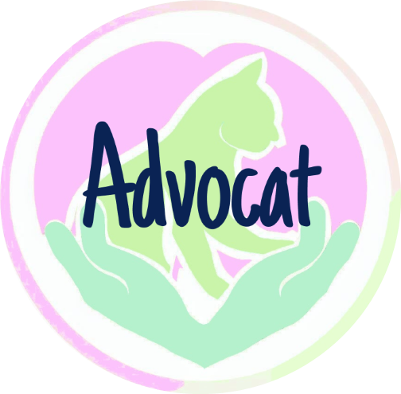

<!-- PROJECT SHIELDS -->
<!--
*** I'm using markdown "reference style" links for readability.
*** Reference links are enclosed in brackets [ ] instead of parentheses ( ).
*** See the bottom of this document for the declaration of the reference variables
*** for contributors-url, forks-url, etc. This is an optional, concise syntax you may use.
*** https://www.markdownguide.org/basic-syntax/#reference-style-links
-->

[![Contributors][contributors-shield]][contributors-url]
[![Forks][forks-shield]][forks-url]
[![Stargazers][stars-shield]][stars-url]
[![Issues][issues-shield]][issues-url]
[![LinkedIn][linkedin-shield]][linkedin-url]

<!-- PROJECT LOGO -->
 

  

<h1 align="center">Advocat</h3>

  

    by Rosie Maguire 
     
    She Codes crowdfunding project - DRF Backend.
     
    <a href="https://github.com/rosiemaguire/Django-crowd-funding-project"><strong>Explore the docs »</strong></a>
     
     
    <a href="https://github.com/rosiemaguire/Django-crowd-funding-project">View Demo</a>
    ·
    <a href="https://github.com/rosiemaguire/Django-crowd-funding-project/issues">Report Bug</a>
    ·
    <a href="https://github.com/rosiemaguire/Django-crowd-funding-project/issues">Request Feature</a>
  

<!-- TABLE OF CONTENTS -->

  
Table of Contents

  <ol>
    <li>
      <a href="#about-the-project">About The Project</a>
      <ul>
        <li><a href="#built-with">Built With</a></li>
      </ul>
    </li>
    <li>
      <a href="#features">Features</a>
      <ul>
        <li><a href="#stretch-goals-and-roadmap">Stretch Goals</a></li>
      </ul>
    </li>
    <!-- <li><a href="#database-schema">Database Schema</a></li> -->
    <!-- <li><a href="#wireframes">Wireframes</a></li>
    <li><a href="#colour-scheme">Colour Scheme</a></li>
    <li><a href="#Fonts">Fonts</a></li> -->
    <li><a href="#getting-started">Getting Started</a>
      <ul>
        <li><a href="#prerequisites">Prerequisites</a></li>
        <li><a href="#installation">Installation</a></li>
        <li><a href="#database-schema">Database Schema</a></li>
        <!-- <li><a href="#updated-wireframes">Updated Wireframes</a></li> -->
        <!-- <li><a href="#screenshots">Screenshots</a></li> -->
        <li><a href="#api-specification">API Specification</a></li>
      </ul>
    </li>
    <li><a href="#Usage">Usage</a></li>
    <ul>
        <li><a href="#creating-a-user">Creating a user</a></li>
        <li><a href="#logging-in-obtain-the-bearer-token">Logging in</a></li>
        <li><a href="#creating-a-project">Creating a project</a></li>
      </ul>
    <li><a href="#contributing">Contributing</a></li>
    <li><a href="#contact">Contact</a></li>

  </ol>

<!-- ABOUT THE PROJECT -->

## About The Project

<!-- [![Product Name Screen Shot][product-screenshot]](https://example.com) -->

This project is the back end of a crowdfunding website which has been created to support people with raising funds for their furry children's medical expenses. You can find the front end repository [here][front-end-repo].

(<a href="#readme-top">back to top</a>)

### Built With
 [![Django][Django.com]][Django-url]

(<a href="#readme-top">back to top</a>)

## Features

- [x] User Log in/Out
- [x] Project creation (must be logged in user)
- [x] Project owner can update project
- [x] Pledge creation (must be logged in as user)
- [x] Pledge supporter can update pledge
- [x] Pledges able to be created without comment (optional field)
- [x] User able to update own details (and Admins able to update any user's details)
- [x] Created date field for projects and pledges are automatically set based on when the pledge/project was created
- [x] Last modified date for projects and pledges are automatically updated with each PUT request

### Stretch Goals and Roadmap

- [x] Pledge put request does not allow any modification of which project it is attached to
- [x] Pledges cannot be created or modified for projects that are set to closed
- [x] Project owner only able to update open/closed and deleted field if project has been set to closed
- [x] Users able to "soft delete" projects and pledges they own (e.g. set deleted field to 1 which hides in front end) own pledges/projects
- [x] Put restrictions around user creation
- [ ] Validation to ensure at least one field is modified in PUT Request (rather than just updating the last_modified date because PUT request fields are identical to data in table)

See the [open issues](https://github.com/rosiemaguire/Django-crowd-funding-project/issues) for a full list of proposed features (and known issues).

(<a href="#readme-top">back to top</a>)

<!-- ## Database Schema

(<a href="#readme-top">back to top</a>)
 -->

<!-- ## Wireframes

(<a href="#readme-top">back to top</a>)

## Colour Scheme

[![Colour Pallete][colour-palette]][colour-palette.url]

(<a href="#readme-top">back to top</a>)

## Fonts

[![Header Font Family][font-family-1]][font-family-1.url] 
[![Body Font Family][font-family-2]][font-family-2.url]

(<a href="#readme-top">back to top</a>)
 -->

## Getting Started

To get a local copy up and running follow these simple example steps.

Deployed Project: [Deployed website](https://advocat.fly.dev/projects/)

<!-- 
 -->

### Prerequisites

- `python`
- `pip`
- unrestricted execution policy (Windows requirement)

### Installation

- Clone a copy of this repo to your local machine. This can be done in the command line by navigating to the desired directory, then running:

        git clone https://github.com/rosiemaguire/Django-crowd-funding-project.git

- Once you have a local version of this repository, you'll need to set up your virtual environment:

  - navigate to the folder that contains the `requirements.txt` file
  - If you're on a windows machine, run the command
          . venv/Scripts/activate
  - If you're on a mac, run the command
          source venv/bin/activate
  - Install the Django library:
          python -m pip install -r requirements.txt
  - Check installation was successful:

          python -m pip freeze

  - Change directory to where manage.py is located:
          cd crowdfunding
  - Make the inital migrations:

          python manage.py migrate

  - Now with everything set up, you'll just need to run the server!

          python manage.py runserver

  - Use the url http://127.0.0.1:8000/, your favourite API Tool (e.g. Insomnia, Postman) and refer to the [API Specifications](#api-specification) to create HTTP requests
  - When you're finished press CTRL+C to quit the server
  - Deactivate the virtual environment by either using the command `deactivate` or terminate your terminal session.

### Database Schema

<!-- ### Updated Wireframes

{{  Updated wireframes }}

 -->
### API Specification

| HTTP Method | Url                  | Purpose                               | Request Body                    | Successful Response Code | Authentication   Authorization                                                                                                                 |
| ----------- | -------------------- | ------------------------------------- | ------------------------------- | ------------------------ | --------------------------------------------------------------------------------------------------------------------------------------------------- |
| GET         | projects/            | Return all projects                   | N/A                             | 200                      | N/A                                                                                                                                                 |
| GET         | pledges/             | Return all pledges                    | N/A                             | 200                      | N/A                                                                                                                                                 |
| GET         | users/               | Return all users                      | N/A                             | 200                      | Bearer Token authentication.   Administrator user can view list of all users. Non administrator user will only return own user object.         |
| POST        | projects/            | Create a new project                  | project object                  | 201                      | Bearer Token authentication.   User must be logged in.                                                                                         |
| POST        | pledges/             | Create a new pledge                   | pledge object                   | 201                      | Bearer Token authentication.   User must be logged in.                                                                                         |
| POST        | users/               | Create a new user                     | user object                     | 201                      | N/A                                                                                                                                                 |
| POST        | api-token-auth/      | Obtain Bearer Token for Authorisation | username and password           | 200                      | N/A                                                                                                                                                 |
| PUT         | projects/< int:pk >/ | Update project                        | project object or project field | 201                      | Bearer Token authentication.   User must be logged in.   Must be the owner of the project.                                                |
| PUT         | pledges/< int:pk >/  | Update pledge                         | pledge object or pledge field   | 201                      | Bearer Token authentication.   User must be logged in.   Must be the owner of the pledge.                                                 |
| PUT         | users/< int:pk >/    | Update user                           | user object or user field       | 201                      | Bearer Token authentication.   User must be logged in.   Must be the user that is being updated or a user with Administrator permissions. |
| DEL         | projects/< int:pk >/ | Delete Project                        | N/A                             | 204                      | Bearer Token authentication.   User must be logged in.   Must be a user with Administrator permissions.                                   |
| DEL         | projects/< int:pk >/ | Delete Project                        | N/A                             | 204                      | Bearer Token authentication.   User must be logged in as administrator.                                                                        |

(<a href="#readme-top">back to top</a>)

## Usage

### Creating a user

- Create a new HTTP Request in your favourite API Tool (e.g. Postman, Insomnia)
  - Use the endpoint https://advocat.fly.dev/users/
- Choose the POST method
- Change the body type to JSON

  - Minimum fields required to create a new user:
    - username
    - password
  - Example request body:

          {
            "username": "janedoe",
            "password": "strongrandompassword",
            "email": "jane@doe.com"
          }

- A successful request will return a 200 response and return the user object

          {
            "username": "janedoe",
            "first_name": "",
            "last_name": "",
            "email": "jane@doe.com",
            "date_joined": "2023-08-12T12:45:29.767395+10:00"
          }

### Logging In (Obtain the bearer token)

- Create a new HTTP POST Request using the endpoint https://advocat.fly.dev/api-token-auth/
- Change the body type to JSON
- Provide the username and password in the body

  - Example request body:

          {
            "username": "janedoe",
            "password": "strongrandompassword"
          }

- A successful request will return a 200 response along with the token you will need to make requests that require authentication

          {
            "token": "c07f7a567c5f29db440bfbd2846b97ffe34f0088"
          }

### Creating a project

- Create a new HTTP POST Request using the endpoint https://advocat.fly.dev/projects/
- Change the body type to JSON

  - Minimum fields required:
    - title
    - description
    - goal
  - Example request body:

          {
            "title": "Test Project",
            "description": "This is a test project",
            "goal": 150,
            "image": "https://picsum.photos/600",
            "is_open": true
          }

- A successful request will return a 201 response and the project object just created

        {
          "id": 1,
          "owner": "admin",
          "title": "Test Project",
          "description": "This is a test project",
          "goal": 150,
          "image": "https://picsum.photos/600",
          "is_open": true,
          "date_created": "2023-08-12T14:58:21.824004+10:00",
          "last_modified": "2023-08-12T14:58:21.824028+10:00"
        }

<!-- ### Screenshots

- [x] A screenshot of Insomnia, demonstrating a successful GET method for any endpoint.
      

- [x] A screenshot of Insomnia, demonstrating a successful POST method for any endpoint.
      

- [x] A screenshot of Insomnia, demonstrating a token being returned.
    

(<a href="#readme-top">back to top</a>)
 -->
<!-- 
 -->
<!-- CONTRIBUTING -->

## Contributing

Contributions are what make the open source community such an amazing place to learn, inspire, and create. Any contributions you make are **greatly appreciated**.

If you have a suggestion that would make this better, please fork the repo and create a pull request. You can also simply open an issue with the tag "enhancement".
Don't forget to give the project a star! Thanks again!

1. Fork the Project
2. Create your Feature Branch (`git checkout -b feature/AmazingFeature`)
3. Commit your Changes (`git commit -m 'Add some AmazingFeature'`)
4. Push to the Branch (`git push origin feature/AmazingFeature`)
5. Open a Pull Request

(<a href="#readme-top">back to top</a>)

<!-- CONTACT -->

## Contact

Rosie Maguire - [@rosie_maguire](https://www.threads.net/@rosie_maguire)

Project Link: [https://github.com/rosiemaguire/Django-crowd-funding-project](https://github.com/rosiemaguire/Django-crowd-funding-project)

(<a href="#readme-top">back to top</a>)

<!-- MARKDOWN LINKS & IMAGES -->
<!-- https://www.markdownguide.org/basic-syntax/#reference-style-links -->

[contributors-shield]: https://img.shields.io/github/contributors/rosiemaguire/Django-crowd-funding-project.svg?style=for-the-badge
[contributors-url]: https://github.com/rosiemaguire/Django-crowd-funding-project/graphs/contributors
[forks-shield]: https://img.shields.io/github/forks/rosiemaguire/Django-crowd-funding-project.svg?style=for-the-badge
[forks-url]: https://github.com/rosiemaguire/Django-crowd-funding-project/network/members
[stars-shield]: https://img.shields.io/github/stars/rosiemaguire/Django-crowd-funding-project.svg?style=for-the-badge
[stars-url]: https://github.com/rosiemaguire/Django-crowd-funding-project/stargazers
[issues-shield]: https://img.shields.io/github/issues/rosiemaguire/Django-crowd-funding-project.svg?style=for-the-badge
[issues-url]: https://github.com/rosiemaguire/Django-crowd-funding-project/issues
[linkedin-shield]: https://img.shields.io/badge/-LinkedIn-black.svg?style=for-the-badge&logo=linkedin&colorB=555
[linkedin-url]: https://linkedin.com/in/rosie-maguire-515777230
[product-screenshot]: images/screenshot.png
[Django.com]: https://img.shields.io/badge/django-092E20?style=for-the-badge&logo=Django&logoColor=WHITE&color=0B4B33
[Django-url]: https://www.djangoproject.com/
[colour-palette]: images/ColorHuntPaletteb5f1cce5fdd1c9f4aafcc2fc.png
[colour-palette.url]: https://colorhunt.co/palette/b5f1cce5fdd1c9f4aafcc2fc
[font-family-1]: images/Just-Another-Hand-font.png
[font-family-1.url]: https://fonts.google.com/specimen/Just+Another+Hand
[font-family-2]: images/Handlee-font.png
[font-family-2.url]: https://fonts.google.com/specimen/Handlee?preview.text=Handlee&preview.text_type=custom&category=Handwriting
[front-end-repo]: https://github.com/rosiemaguire/crowdfunding-frontend
